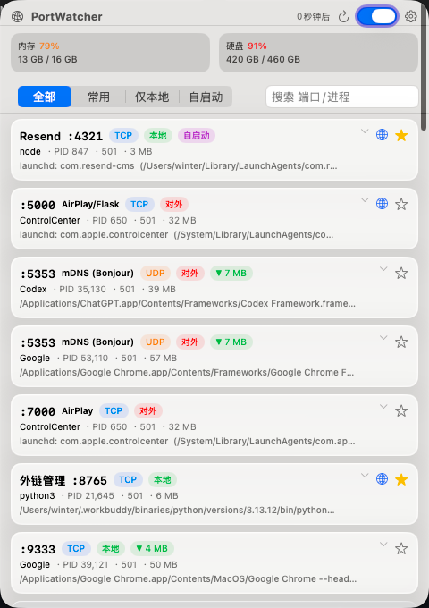
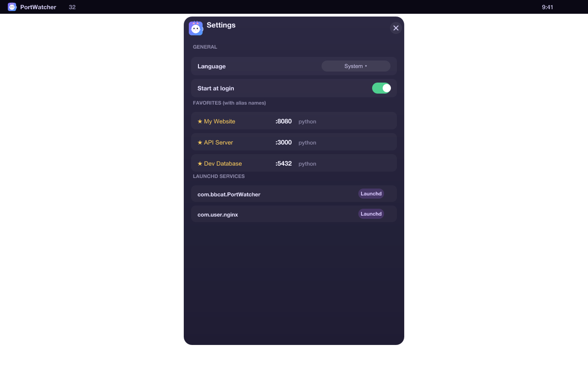
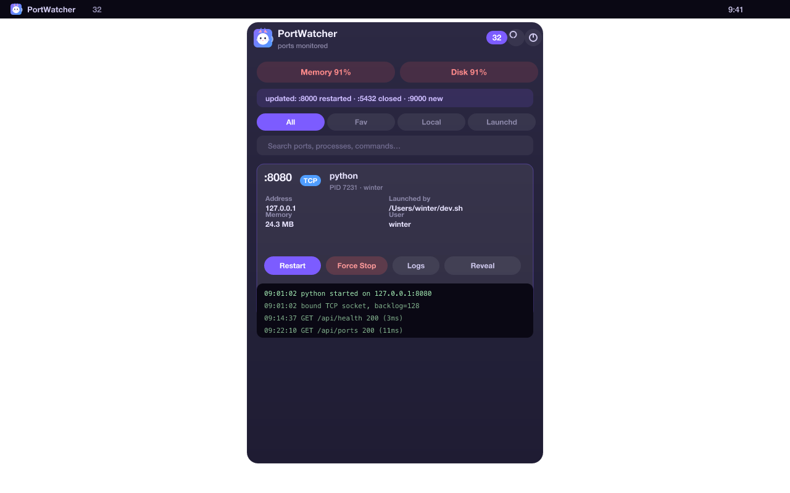

# PortWatcher — macOS 顶部栏端口监视器

> 英文版 / English version: [README_EN.md](README_EN.md)

常驻 macOS 顶部栏的端口占用监控工具。原生 SwiftUI + AppKit，**零第三方依赖**。

## 功能

- **顶部栏实时计数**：菜单栏图标后显示当前监听端口数量，点开弹出面板。
- **系统资源**：面板顶部实时显示内存占用比例（Activity Monitor 口径：active + speculative + wired + compressed，不含可回收的 inactive 缓存）与硬盘利用率（已用 / 总量，取自 `df`）。占用过高时数字变橙/红。
- **全端口清单**：TCP（LISTEN）＋ UDP（已绑定）全部端口，每行含
  - 端口号、协议（TCP/UDP）、进程名、PID、用户
  - 监听地址（区分 `本地` / `对外` / 特定地址）
  - 启动源头：launchd 标签 + plist 路径，或完整启动命令
  - 内存占用：进程 RSS
- **端口变更提示**：每次扫描自动对比上一次结果，顶部变更栏显示有变动的端口
  （如 `:8000 新增 · :5432 重启 · :9000 关闭`），行内附 `NEW` / `⟳ 重启` / 内存 `▲▼` 标签。
- **筛选 / 搜索**：全部 / 常用端口 / 仅本地 / 自启动，按端口、进程、命令搜索。
- **详情与日志**：点开任意行展开
  - 基本信息网格 + 启动源头 + plist 内容
  - 查看该进程的系统日志（`log show --predicate processID`）
  - 在 Finder 中定位可执行文件、复制命令
- **重启 / 强制停止**
  - 重启：launchd 托管进程执行 `launchctl kickstart -k`；普通进程 kill 后按原命令重新启动（等待 1s 端口释放）。
  - 强制停止：`kill -9`（launchd 进程走 `launchctl kill SIGKILL`），带二次确认。
  - 操作写入历史（仅保留近 48 小时，持久化到 ~/Library/Application Support/PortWatcher）。
- **登录时启动**：建议把 `PortWatcher.app` 放到 `/Applications`，否则系统可能拒绝注册登录项。
- **macOS 26 Liquid Glass 设计**：自动跟随亮/暗色外观。
- **多语言**：默认英文界面，内置中文，跟随系统语言，也可在「设置」中手动切换。

## 预览

<p align="center">
  
  
  
</p>

## 安装

从 [Releases](https://github.com/2winter-dev/PortWatcher/releases) 下载最新的 `PortWatcher.dmg`，打开后把 **PortWatcher.app** 拖进「应用程序」即可。

> 需要 **macOS 26** 及以上。

## 开发

本仓库是 SwiftPM 工程（`Package.swift`），无需 Xcode 项目文件即可完整构建。

- **前提**：Xcode 26 / Swift 6 命令行工具。
- **本地跑起来**：

  ```bash
  git clone https://github.com/2winter-dev/PortWatcher.git
  cd PortWatcher
  bash build-app.sh
  open build/PortWatcher.app
  ```

- **用 Xcode 调试**：`open Package.swift` 即可在 Xcode 里运行 / 断点调试（菜单栏 app 请在 Xcode 的 My Mac 目标下运行）。
- **改图标 / 顶栏图**：源文件在 `app-preview/icon/master.svg` 与 `app-preview/menubar/template.svg`，用 `app-preview/render.cjs`（`@resvg/resvg-js`）渲染 PNG，`.icns` 用 `iconutil` 合成；仓库已带预渲染产物，重渲染后重跑 `build-app.sh` 即可生效。
- **源码布局**：见下方「项目结构」。

## 构建与发布

前提：**Xcode 26 / Swift 6**（命令行工具即可）。

```bash
git clone https://github.com/2winter-dev/PortWatcher.git
cd PortWatcher
bash build-app.sh
open build/PortWatcher.app
```

`build-app.sh` 会以 release 模式编译，装配 `build/PortWatcher.app`，并拷入应用图标与顶栏模板图。

若要产出**已签名、已公证、可直接分发**的磁盘镜像：

```bash
export DEV_ID="Developer ID Application: Your Name (TEAMID)"
export NOTARY_PROFILE="AC_PASSWORD"   # 来自 xcrun notarytool store-credentials
bash notarize.sh      # 用 Developer ID 签名（hardened runtime，不开沙箱）
bash make-dmg.sh      # 打包成 PortWatcher.dmg
```

## 使用

- 顶部栏点图标 → 弹出面板。
- `自动刷新` 开关：默认每 5 秒刷新一次。
- 展开行 → 重启 / 强制停止 / 加载日志 / 在 Finder 显示。
- 顶栏右侧**齿轮 = 设置**（低频项收纳区）：登录时启动、退出 PortWatcher、版本号。
- **右键**菜单栏图标 → 关于 / 退出。

## 工作原理

PortWatcher 只读取本机系统状态，不访问网络，也没有任何遥测。它通过调用标准 macOS 工具获取信息：

| 数据 | 来源 |
|------|------|
| 监听端口 | `lsof -iTCP -sTCP:LISTEN`、`lsof -iUDP` |
| 进程信息 | `ps` |
| 启动源头 | `launchctl list` + `.plist` 解析 |
| 进程日志 | `log show` |
| 内存 / 硬盘 | `vm_stat`、`sysctl`、`df` |

## 隐私

PortWatcher **不收集任何数据、不进行任何网络请求**。唯一的对外动作，是你在点「浏览器打开」时打开本机的 `http://127.0.0.1:<端口>`。所有信息都留在你的 Mac 上。

## 项目结构

```
Sources/PortWatcher/
  AppDelegate.swift     菜单栏图标、弹出层、右键菜单、关于
  ContentView.swift     弹出层 UI：顶栏、筛选、列表、详情、历史
  PortMonitor.swift     扫描编排、常用收藏、端口备注、变更 diff
  PortScanner.swift     lsof/ps/launchctl 解析、服务名提示
  SystemStats.swift    内存 / 硬盘快照
  Actions.swift        重启 / 强制停止 / 日志拉取 / 登录项
  HistoryStore.swift   48 小时操作历史（持久化到 ~/Library）
  Localization.swift   en/zh 翻译表 + 语言切换
  main.swift           NSApplication 入口
app-preview/          图标与顶栏 SVG 源文件、渲染脚本、应用资料
build-app.sh          装配 .app
notarize.sh           Developer ID 签名 + 公证
make-dmg.sh           打包成 .dmg
```

## 许可证

[MIT](LICENSE) © 2026 2winter。
